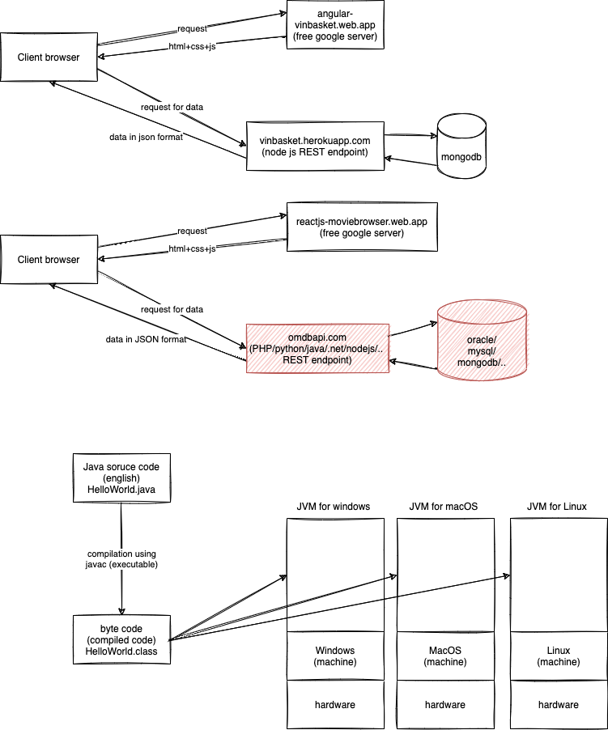

# Day 1

## Topics covered:

-   Java programming basics
-   JDK, JRE, and JVM
-   Variables, data types, operators, iterations, methods



## Data types for variables:

1. Primitives (keywords)
    - Integers
        - byte 1 byte (8 bits)
        - short 2 bytes (16 bits)
        - int 4 bytes (32 bits) (preferred)
        - long 8 bytes (64 bits)
    - Real numbers
        - float 4 bytes (32 bits)
        - double 8 bytes (64 bits) (preferred)
    - Characters
        - char 2 bytes (16 bits)
    - Logical
        - boolean 1 bit (true/false)
2. References
    - class, interface, enum, annotation, arrays
    - 4 bytes in 32 bit environment
    - 8 bytes in 64 bit environment

## Wrapper class

-   byte --> java.lang.Byte
-   short --> java.lang.Short
-   int --> java.lang.Integer
-   long --> java.lang.Long
-   float --> java.lang.Float
-   double --> java.lang.Double
-   char --> java.lang.Character
-   boolean --> java.lang.Boolean

## Naming convesion

-   for packages,
    -   use.lower.case.words.delimited.with.dots
-   for identifiers (names of variables, methods or functions)
    -   camelCaseForThese
-   for reference data types (class, interface, enum and annotations)
    -   PascalCaseForThese
-   no use of underscores
-   for constants (final variables)
    -   UPPER_CASE_WITH_UNDERSCORE_DELIMITER

## Programming constructs

-   selection
    -   if/else
    -   switch/case/default
    -   ternary operator
        -   expr1 ? expr2 : expr3
-   iteration
    -   while
    -   do-while
    -   for

# Assignments

### Assignment 1

Implement the body for the following function:

```java
static boolean isValidDate(int year, int month, int day) {
	// do stuff here
	return false;
}
```

The function should check if the parameter values constitute a valid calendar date or not. Accordingly return true or false.

For example,

1. year=2018, month=13, day=1 is an invalid date as the possible values for month is 1 to 12.
2. year=2018, month=2, day=29 is an invalid date as the maximum days in February is 28 in the year 2018
3. year=2016, month=2, day=29 is a valid date.

Write a Java program to call the above function multiple times with different values.

---

### Assignment 2

Implement the body for the following function:

```java
static boolean isPrimeNumber(int num) {
	// do stuff here
	return false;
}
```

The function should check and return true only if the number passed as argument is a prime number.

Write a Java program to call the above function multiple times with different values.

---

### Assignment 3

Write a function called "sumOfPrimes", that takes two integers as input and returns the sum of all the prime numbers between the same.

```java
public static int sumOfPrimes(int from, int to) {
	// do stuff here
	return 0;
}
```

Write a Java program to call the above function multiple times with different values.

---

### Assignment 4

Write a Java program to print the following pattern:

```
*
**
***
****
*****
```

The number of rows should be based on the value of a variable "num", and the number of stars in a row is based on the row number itself.

---

### Assignment 5

In trignometry, the Sine of an angle is represented by the series below:


Write a Java function that accepts angle in degrees and returns the sine of the given angle.

Call the function in main, multiple times by supplying multiple values and verify the same.

PS:

-   Divide the function into small reusable functions, if possible.
-   Do not use builtin Java classes like `Math`
-   Inside the **sine** function, use a loop that iterates for **n** times (for example 10)

---

### Assignment 6

Implement the Java function listed below:

```java
public static void printCalendar(int month, int year) {
	/// do stuff here
}
```

The function should accept `month` and `year` and print the calendar for the same. If inputs are invalid, appropriate error message/s should be printed.

Sample output for the inputs (8, 2018):

```
Su Mo Tu We Th Fr Sa
          1  2  3  4
 5  6  7  8  9 10 11
12 13 14 15 16 17 18
19 20 21 22 23 24 25
26 27 28 29 30 31
```

PS:

-   Do not use any builtin Java classes like `Date` or `Calendar`
-   Divide the function into small reusable functions, if possible.

---
