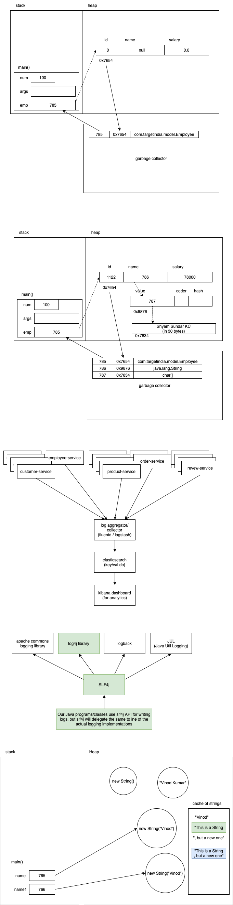

# Day 2

## Topics to be covered:

-   References, classes and objects
-   String handling



## Assignments

### Assignment 1

Implement the Java function listed below:

```java
public static void printCalendar(int month, int year) {
	/// do stuff here
}
```

The function should accept `month` and `year` and print the calendar for the same. If inputs are invalid, appropriate error message/s should be printed.

Sample output for the inputs (8, 2018):

```
Su Mo Tu We Th Fr Sa
          1  2  3  4
 5  6  7  8  9 10 11
12 13 14 15 16 17 18
19 20 21 22 23 24 25
26 27 28 29 30 31
```

PS:

-   Do not use any builtin Java classes like `Date` or `Calendar`
-   Divide the function into small reusable functions, if possible.

---

### Assignment 2

Write a function called "sumOfEvensAndOdds", that takes an array of integers as input and returns another array of integers of length 2. The first element in the returned array is the sum of all even numbers in the input array, and the second element in the returned array is the sum of all odd numbers in the input array.

```java
public static int[] sumOfEvensAndOdds(int []nums) {
	// do stuff here
	return null;
}
```

For example,

```java
int [] nums = {1, 2, 3, 4, 5, 6, 7, 8, 9, 10};
int [] result = sumOfEvensAndOdds(nums);
// result should be equal to {30, 25}
```

Hint:

An arrays is created as shown below:

```java
int []arr = new int[2];
arr[0] = 12;
arr[1] = 100;
```

or

```java
int []arr = {12, 100}
```

Call the function in main, multiple times by supplying multiple values and verify the same.

---

### Assignment 3

Write a function called "reverseByWords", that takes a sentence (string) as an input, and returns another string. The return value must be a sentence in which the words in the original sentence appear in reverse order.

```java
public static String reverseByWords(String sentence) {
	// do stuff here
	return null;
}
```

For example,

```java
String out = reverseByWords("my name is vinod and i live in bangalore");
// the variable "out" should be equal to "bangalore in live i and vinod is name my".
```

Call the function in main, multiple times by supplying multiple values and verify the same.

---

### Assignment 4

Write a function called "inWords" that takes a number between 1 and 99,99,99,999 and returns a String representing the input number in words.

```java
public static String inWords(int num) {
	// do stuff here
	return null;
}

```

For example,

```java
inWords(12345);
// should return "twelve thousand three hundred forty five"
inWords(10203040);
// should return "one crore two lakh three thousand forty"
inWords(101);
// should return "one hundred one"
```

Call the function in main, multiple times by supplying multiple values and verify the same.
