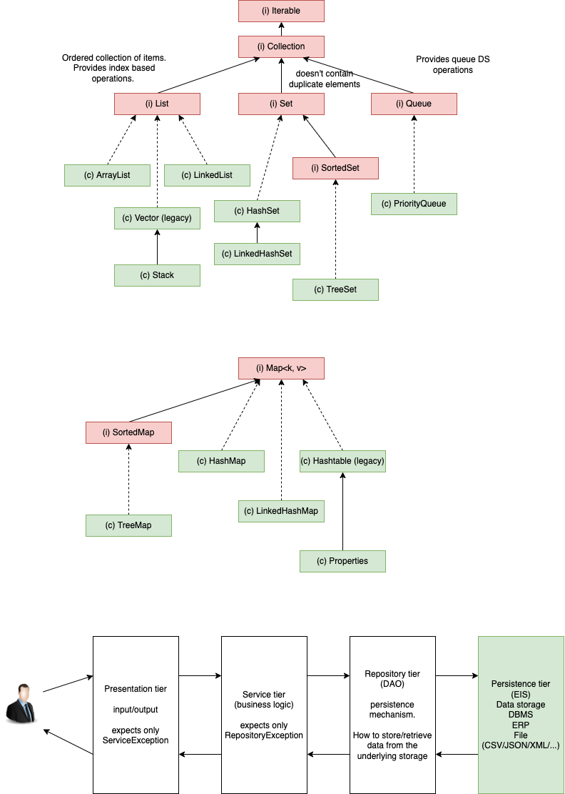

# Collections in Java

1. Functional interface - An interface with exactly one abstract method
2. Pure function - A function that takes parameter/s and work on the same, and return a value; has no dependency on any other functions

                        1122
                        /  \
                           2122
                           /  \
                              7822
                              /  \
                            6726
                            /  \